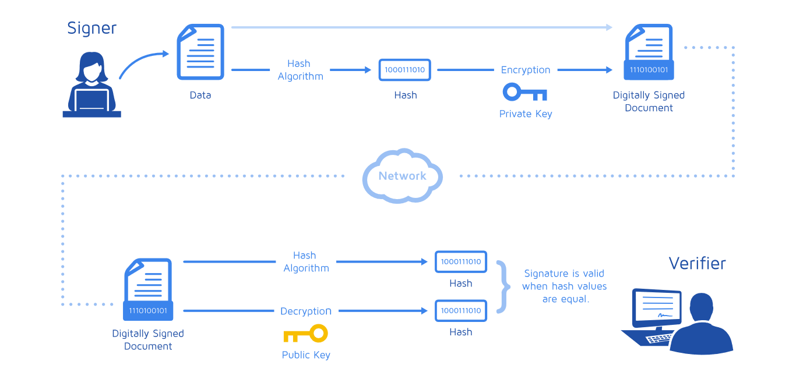

### An Introduction of Cryptography

--

What is cryptogrphy?


Notes:
> Cryptography or cryptology is the practice and study of techniques for secure communication in the presence of third parties called adversaries.

### 密码学 (Cryptography/Cryptology)
--

### 密码学 (Cryptology)

> (from the Greek kryptós, "hidden," and lógos, "word") is the science of secure (or, generally speaking, secret) communication. 

* 密码编码学 (Cryptography)
* 密码分析学 (Cryptanalysis)

Notes:
> was concerned initially with providing secrecy for written messages...


--

### 术语 Terminology

* cipher
* 明文 plaintext
* 密文 ciphertext
* 加密 encrypt(encipher)
* 解密 decrypt(decipher)

Notes:
* 密码分析 cryptanalysis
    * algorithm for transforming plaintext to ciphertext
    * message to be sent, in readable form
    * message in coded form
    * turn plaintext into ciphertext
    * turn ciphertext back into plaintext
    * the art and science of breaking the cipher text

--

### 必备知识(Prerequisites)

* [离散数学 Discrete mathematics](https://en.wikipedia.org/wiki/Discrete_mathematics)
* [模算数 Modular arithmetic](https://en.wikipedia.org/wiki/Modular_arithmetic)
* [数论 Number Theory](https://en.wikipedia.org/wiki/Number_theory)
* [概率论 Probability theory](https://en.wikipedia.org/wiki/Probability_theory)
* [数学证明 Mathematical proof](https://en.wikipedia.org/wiki/Mathematical_proof)
* ...

--

### reference

* [Wikipedia: Cryptography](https://en.wikipedia.org/wiki/Cryptography)

---

### Why use Cryptography?

* 信息的机密性 Confidentiality
* 信息的完整性 Integrity
* 信息的认证性 Authentication
* 信息的不可抵赖性（数字签名） Non-Repudiation

--

### 对称密码 Symmetric Key Cryptography

* 传统密码 Conventional cryptogrphy
* 私钥密码 Secret-key cryptography
* 公共密钥密码 Common-key cryptography
* 块密码 Block Cipher/流密码 Stream Cipher

--

### 非对称密码 Asymmetric Key Cryptography

* Public Key Cryptography
* Public Key for encrypt data
* Private Key is for decrypt the data
* RSA(Rivest-Shamir-Adleman)
* DSA(Digital Signature Algorithm), Diffie-Helman

---

### 对称密码 Symmetric-key cryptography

* Stream ciphers
    * OTP
    * RC4/RC5(Rivest Cipher)
    * CSS
* Block ciphers
    * DES(Data Enryption Standard)
    * 3DES
    * AES(Advanced Encryption Standard)
    * Blowfish
    * Twofish

--

### Skytale
 


--

### Skytale

```
          | I | a | m | h | u |    |
     _____| r | t | v | e | r |____| 
    |     | y | b | a | d | l |
    |     | y | H | E | L | P |
```
> "I am hurt very badly HELP" 

> "IryyatbHmvaEhedLurlP"

[Cryptool online: Scytale](https://www.cryptool.org/en/cto-ciphers/scytale)

--

### ROT

> HELLO -> URYYB -> HELLO

--
### ROT13


Note: ROT13 replaces each letter by its partner 13 characters further along the alphabet. 

--
### XOR encryption

plaintext | "a" | "b" | "c"
----|-----|-----|----
Dec | 97 | 98 | 99
Hex | 01100001 | 01100010 | 01100011
x-Key | 01100100 | 01100100 | 01100100
cipherHex | 00000101 | 00000110 | 00000111
cipherDec | 5 | 6 | 7

--
### XOR decryption

cipherDec | 5 | 6 | 7
----|-----|-----|----
binary | 00000101 | 00000110 | 00000111
x-Key | 01100100 | 01100100 | 01100100
result | 01100001 | 01100010 | 01100011
Dec | 97 | 98 | 99
 | "a" | "b" | "c"

--
### XOR decryption

cipherDec | 5 | 6 | 7
----|-----|-----|----
binary | 00000101 | 00000110 | 00000111
wrong-Key | 01101011 | 01101011 | 01101011
result | 01101110 | 01101101 | 01101100
Dec | 110 | 109 | 108
 | "n" | "m" | "l"


--

Vigenère cipher


--


--

--

* | string
--------|-----------
Plaintext: | ATTACKATDAWN
Key | LEMONLEMONLE
Ciphertext | LXFOPVEFRNHR

--


Note: 
* Enigma was invented by the German engineer Arthur Scherbius at the end of World War I.
* Alan Turing (1912-1954) was a remarkable British cryptologist and mathematician of that time.

--

### Sigaba


Note:
ECM Mark II was a cipher machine used by the United States for message encryption from World War II until the 1950s. The machine was also known as the SIGABA or Converter M-134 by the Army, or CSP-888/889 by the Navy, and a modified Navy version was termed the CSP-2900. 

--

### Enigma machine


[Cryptool online: Enigma](https://www.cryptool.org/en/cto-ciphers/enigma)


--


---

### 公钥密码 Public-key cryptography

--


Notes:


1. Bob and Alice are shared a key
2. Bob encrypted a message with the key and send the encrypted message to Alice
3. Alice decrpyted Bob's message with the same key


1. Bob encrypted a message with Alice's public key
2. Alice decrpyted Bob's message with her private key


1. Alice signs a message(not encrypted) with her private key. 
2. Bob can verify that Alice sent the message and that the message has not been modified.


--


--
> RSA was designed by Ron Rivest, Adi Shamir and Leonard Adleman in 1977. 


[Cryptool online: RSA](https://www.cryptool.org/en/cto-highlights/rsa-step-by-step)


---
### 消息摘要和数字签名(Digital Signature)


Notes:
### Simple diagram of the process of digital Signing and verification



--


---

### 散列函数 Hash functions

* 高速的完整性鉴别
* 防止发送信息的一方否认曾经发送信息
* MD5, SHA

--

### MD5 

* 128bit

--

### SHA1/SHA2

* SHA-1(160bit), SHA-2(256/384/512bit)

--

### MAC

* Message Authentication Code

--

### HMAC

* Hash-Based Message Authentication Code

Notes:
### Base64
[](https://en.wikipedia.org/wiki/Base64)
[](https://www.pixelstech.net/article/1457585550-How-does-Base64-work)

---

### TO BE CONTINUE...

* SSL/TLS/OpenSSL
* HTTPS/SSH/SFTP
* PGP/OpenPGP/GnuPG(GPG)
* IKEv1/IKEv2
* IPSec
* X.509
* ECC(Elliptic Curve Cryptography)
* PKI(Public Key Infrastructure)

--

* Demo of OpenSSL
* Demo of GPG

---

# Q&A

---


### Reference 

* [Portal: Cryptography](https://en.wikipedia.org/wiki/Portal:Cryptography)
* [Outline of Cryptography](https://en.wikipedia.org/wiki/Outline_of_cryptography)
* [Wikipedia: Encryption](https://en.wikipedia.org/wiki/Encryption)
* [Cryptool](https://www.cryptool.org/images/ct1/presentations/CrypTool1-Presentation-en.pdf)
* [Cryptography Visualization Software Downloads ](http://pages.mtu.edu/~shene/NSF-4/)
* [Art of the Problem](https://www.youtube.com/user/ArtOfTheProblem)
* [Crypto-IT](http://www.crypto-it.net/eng/index.html)
* [What is a Digital Signature](https://dzone.com/articles/what-is-a-digital-signature)
* [Alan Turing Cryptography Competition](http://www.maths.manchester.ac.uk/cryptography_competition/archive.php)
* [A slide of Cryptography](https://slides.com/kenilt/crytography/)
* [redhat: Introduction to Public-Key Cryptography](https://access.redhat.com/documentation/en-US/Red_Hat_Certificate_System/8.1/html/Deploy_and_Install_Guide/Introduction_to_Public_Key_Cryptography.html)

* [Cryptography Visualization Software](http://pages.mtu.edu/~shene/NSF-4/)

---

# THE END